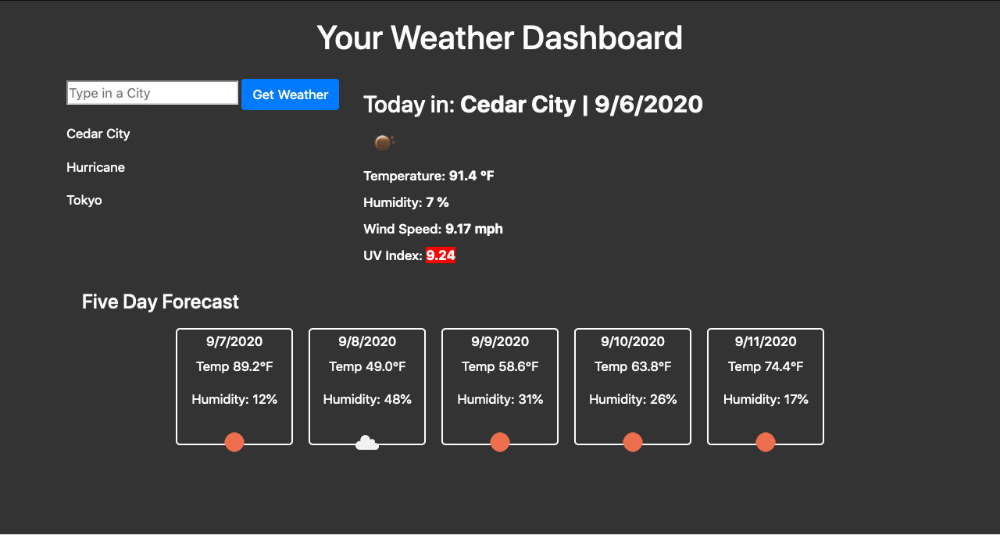

# Weather Dashboard
Type in any city in the world and it will populate with the date, temperature, humidity, and uv index for that current day then give you the five day forecast.

## What was used?
- HTML
- CSS
- Javascript
- OpenWeatherMap API

---

## Screen Shot

## Links to Deployed Website
[Weather](https://bdrawe.github.io/weather-dashboard/)

